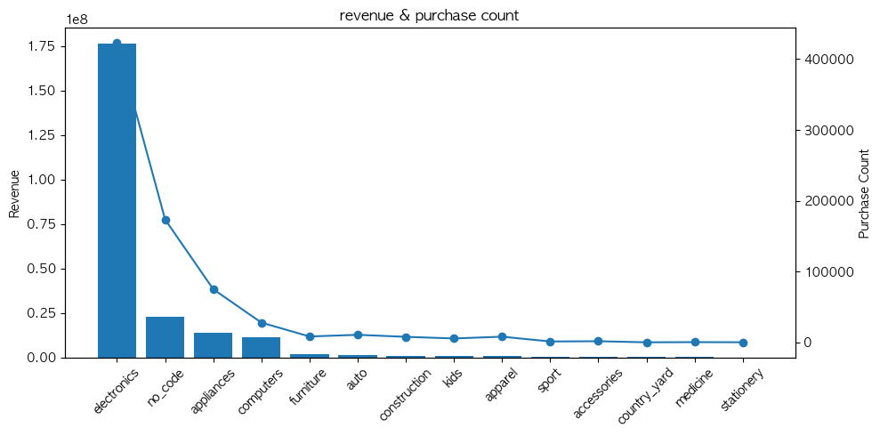
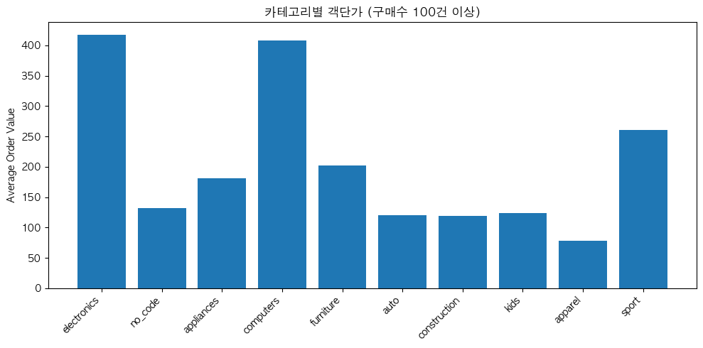
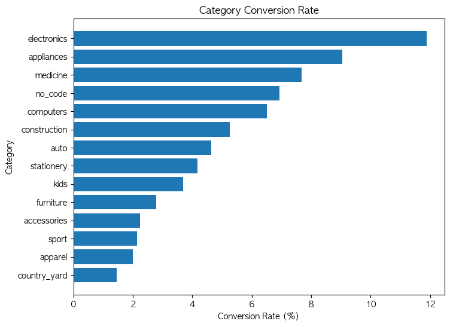
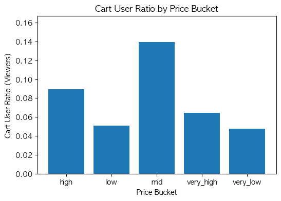
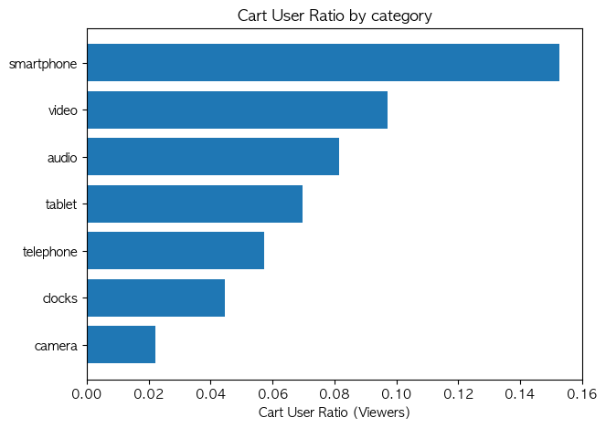
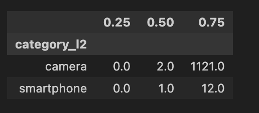

2019년 10월 이커머스 로그데이터를 대상으로 분석을 수행했습니다

목적 : 구매 단계에서 이탈 원인 분석

## 1. 매출, 객단가 등을 비교해 주요 카테고리 선정

먼저 매출과 객단가(AOV)를 기준으로 주요 카테고리를 비교해 분석 우선순위를 설정했습니다.

전체 매출 및 구매 수 기준으로 electronics 카테고리가 가장 높은 기여도를 보였으며 평균 객단가 또한 타 카테고리 대비 높게 나타났습니다.

→ 이에 따라 electronics 카테고리를 주요 분석 대상으로 선정했습니다.

## 2. 매출 및 객단가가 높은 일렉트로닉 카테고리의 구매 단계 비교 

구매 단계별 유저 도달률을 비교한 결과 View 대비 Cart 단계에서 유저 감소 폭이 크게 나타났습니다

## 3. 해당 가격대, 카테고리를 조회한 유저 중 장바구니에 담은 유저의 비율을 비교

Cart 단계의 이탈 원인을 파악하기 위해 electronics 카테고리 내에서 가격대별, 세부 카테고리별 전환율을 비교했습니다.

중간 가격대 상품이 가장 높았으며 세부 카테고리 기준으로는

smartphone: 높은 전환율

camera: 낮은 전환율을 보였습니다.

→ 동일한 electronics 카테고리 내에서도 상품 특성에 따라 구매 전환 구조가 다름을 확인했습니다.

## 4. 주 매출이면서 전환율이 높았던 스마트폰과 전환율이 낮았던 카메라 유저 시간 비교

주 매출 카테고리이면서 전환율이 높았던 smartphone과 전환율이 낮았던 camera를 대상으로 view 이후 Cart까지 걸린 시간을 유저 기준으로 비교했습니다.

Smartphone: 대부분의 유저가 짧은 시간 내 Cart로 전환

Camera: 일부 유저는 장시간 탐색·비교 후 Cart로 전환

→ Smartphone은 즉시 전환형 상품, Camera는 숙고형 상품이라는 차이를 확인했습니다.

## 결론
#### 1. 즉시 전환형 상품 (Smartphone)

View 이후 대부분 10분 이내 Cart로 전환

구매 의도가 이미 형성된 상태로 유입되는 상품

→ 제안

- 상품 상세 페이지 상단에 구매 CTA 고정

- 배송/재고/혜택 정보 즉시 노출

- 지연 할인·리마인드보다는 즉시 구매 유도 전략 적용

#### 2. 숙고형 상품 (Camera)

View 이후 장시간 비교·탐색 후 Cart로 전환

단순 할인만으로는 전환을 유도하기 어려운 구조

→ 제안

- 스펙 비교표, 리뷰 요약 등 정보 중심 콘텐츠 강화

- 즉시 할인 대신 지연 리마인드 또는 비교 콘텐츠 노출 후 프로모션

- Cart 진입 전 의사결정을 돕는 UX 개선 우선